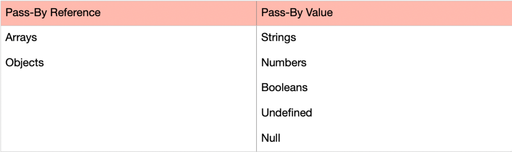

# <span></span> Pass By Reference vs Pass By Values

## At the end of this lesson, you should:
1. Be able to explain what pass by reference means
3. Be able to explain what pass by value means

## Introduction
This lesson is about how data is being stored and moved around in memory. We will be going high level here to get a general understanding

## Pass by value
`Pass by value` is basically just create a new space in memory & then copy the value over. Eg:
```
let abc = 1;
let def = abc;
console.log('abc: ',abc); // 1
console.log('def: ',def); // 1
console.log(' --------- ');
abc++;
console.log('abc: ',abc); // 2
console.log('def: ',def); // 1
```
As you can see above, by modifying `abc`, `def` isn't affected.

In Javascript, all Primitive values are `pass by value`

## Pass by reference
`Pass by reference` is basically passing the reference to the memory space instead of making a copy of the value.
```
const arr1 = [1,2,3];
const arr2 = arr1;
console.log('arr1: ', arr1);
console.log('arr2: ', arr2);
console.log(' --------- ');
arr1.push(4);
console.log('arr1: ', arr1);
console.log('arr2: ', arr2);
```

---

## Summary of which is pass by reference and which is pass by value
