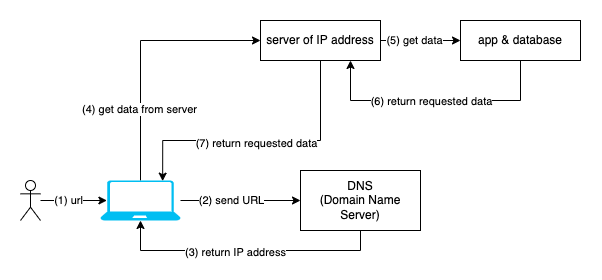

#  Web

## At the end of this lesson, you should:
1. Know the brief history of the web
2. What happens when we key in a URL in our web browser?
3. Knows the building blocks of a web page

## Brief history of the web
- 1961 - Leonard Kleinrock wrote about ARPANET, the predecessor of the Internet
- 1965 - Two computers at MIT Lincoln Lab communicate with one another using packet-switching technology.
- 1973 - Global networking becomes a reality as the University College of London (England) and Royal Radar Establishment (Norway) connect to ARPANET. The term Internet is born.
- 1991 - CERN introduces the World Wide Web to the public.

## What happens when we key in a URL in our web browser?

## Building blocks of a web page:
1. HTML: Skeleton
2. CSS: Looks - muscles, handsome, pretty, have hair, have hands, etc
3. Javascript: Functions - able to move legs, able to move hands, close eyes, etc