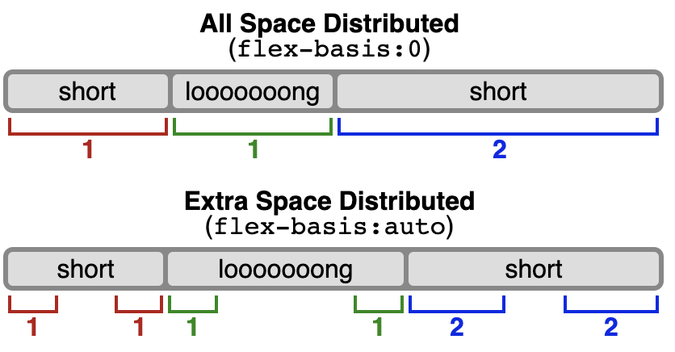

# <span></span> CSS: Flexbox

## At the end of this lesson, you should:
1. What is `flexbox`?
2. Know what happens when a URL is entered in the browser
3. Brief intro to HTML, CSS & Javascript

## What is `flexbox`?
A CSS3 layout mode that provides an easy & clean way to arrange items within a container:

  - No floats to put container side by side!
  - Responsive & mobile friendly
  - Positioning is much easier!
  - Flex container's margins to not collapse with the margins of its contents
  - Order of elements can easily be changed without editing HTML


## Flexible box model concept

1. The ability to alter item width & height to best fit in its containers available free space
2. Flexbox is direction-agnostic (can work well for horizontal & vertical)
3. Built for small-scale layouts

## Coding!
### To set a container to be a flexbox:
```css
.container {
  display: flex; /* or inline-flex */
}
```

### Direction of flex children:
```css
.container {
  flex-direction: row | row-reverse | column | column-reverse;
}
```
- `row (default)`: left to right in ltr; right to left in rtl
- `row-reverse`: right to left in ltr; left to right in rtl
- `column`: same as row but top to bottom
- `column-reverse`: same as row-reverse but bottom to top

### Wrapping flex children:
```css
.container {
  flex-wrap: nowrap | wrap | wrap-reverse;
}
```
- `nowrap (default)`: all flex items will be on one line
- `wrap`: flex items will wrap onto multiple lines, from top to bottom.
- `wrap-reverse`: flex items will wrap onto multiple lines from bottom to top.

### Shorthand property:
```css
.container {
  flex-flow: flex-direction flex-wrap;
}
```
eg:
```css
.container {
  flex-flow: row nowrap;
}
.container {
  flex-flow: row wrap;
}
.container {
  flex-flow: column nowrap;
}
.container {
  flex-flow: column wrap;
}
```

### Justify-content
This affects the main axis. Main axis is defined as the same direction the `flex-direction` is set.
- if `flex-direction` is set to `row`, main axis is `horizontal`
- if `flex-direction` is set to `column`, main axis is `vertical`

```css
.container {
  justify-content: flex-start | flex-end | center | space-between | space-around | space-evenly ... + safe | unsafe;
}
```
- `flex-start (default)`: items are packed toward the start of the flex-direction.
- `flex-end`: items are packed toward the end of the flex-direction.
- `center`: items are centered along the line
- `space-between`: items are evenly distributed in the line; first item is on the start line, last item on the end line
- `space-around`: items are evenly distributed in the line with equal space around them. Note that visually the spaces aren’t equal, since all the items have equal space on both sides. The first item will have one unit of space against the container edge, but two units of space between the next item because that next item has its own spacing that applies.
- `space-evenly`: items are distributed so that the spacing between any two items (and the space to the edges) is equal.

There are also two additional keywords you can pair with these values: `safe` and `unsafe`. Using `safe` ensures that however you do this type of positioning, you can’t push an element such that it renders off-screen (e.g. off the top) in such a way the content can’t be scrolled too (called “data loss”).

### align-items
This affects the cross axis. Cross axis is defined as the perpendicular direction the `flex-direction` is set.
- if `flex-direction` is set to `row`, cross axis is `vertical`
- if `flex-direction` is set to `column`, cross axis is `horizontal`
```css
.container {
  align-items: stretch | flex-start | flex-end | center | baseline | first baseline | last baseline | start | end | self-start | self-end + ... safe | unsafe;
}
```
- `stretch (default)`: stretch to fill the container (still respect min-width/max-width)
- `flex-start / start / self-start`: items are placed at the start of the cross axis. The difference between these is subtle, and is about respecting the flex-direction rules or the writing-mode rules.
- `flex-end / end / self-end`: items are placed at the end of the cross axis. The difference again is subtle and is about respecting flex-direction rules vs. writing-mode rules.
- `center`: items are centered in the cross-axis
- `baseline`: items are aligned such as their baselines align

The safe and unsafe modifier keywords can be used in conjunction with all the rest of these keywords (although note [browser support](https://developer.mozilla.org/en-US/docs/Web/CSS/align-items#browser_compatibility)), and deal with helping you prevent aligning elements such that the content becomes inaccessible.

### align-content
This aligns a flex container’s lines within when there is extra space in the cross-axis, similar to how justify-content aligns individual items within the main-axis.

**Note**: This property only takes effect on multi-line flexible containers, where flex-wrap is set to either wrap or wrap-reverse). A single-line flexible container (i.e. where flex-wrap is set to its default value, no-wrap) will not reflect align-content.
```css
.container {
  align-content: flex-start | flex-end | center | space-between | space-around | space-evenly | stretch | start | end | baseline | first baseline | last baseline + ... safe | unsafe;
}
```
- `normal (default)`: items are packed in their default position as if no value was set.
- `flex-start / start`: items packed to the start of the container. The (more supported) flex-start honors the flex-direction while start honors the writing-mode direction.
- `flex-end / end`: items packed to the end of the container. The (more support) flex-end honors the flex-direction while end honors the writing-mode direction.
- `center`: items centered in the container
- `space-between`: items evenly distributed; the first line is at the start of the container while the last one is at the end
- `space-around`: items evenly distributed with equal space around each line
- `space-evenly`: items are evenly distributed with equal space around them
- `stretch`: lines stretch to take up the remaining space

### gap, row-gap, column-gap
The gap property explicitly controls the space between flex items. It applies that spacing only between items not on the outer edges.
```css
.container {
  display: flex;
  gap: 10px;
  gap: 10px 20px; /* row-gap column gap */
  row-gap: 10px;
  column-gap: 20px;
}
```
Think of this as minimum gutter. This is because if we have `justify-content: space-betwee`, the gutter might be bigger than the one set here.

### flex-grow
This defines the ability for a flex item to grow if necessary. It accepts a unitless value that serves as a proportion. It dictates what amount of the available space inside the flex container the item should take up.

If all items have flex-grow set to 1, the remaining space in the container will be distributed equally to all children. If one of the children has a value of 2, that child would take up twice as much of the space either one of the others (or it will try, at least).
```css
.item {
  flex-grow: 4; /* default 0 */
}
```

### flex-shrink
This defines the ability for a flex item to shrink if necessary.
```css
.item {
  flex-shrink: 3; /* default 1 */
}
```

### flex-basis
This defines the default size of an element before the remaining space is distributed
```css
.item {
  flex-basis: size | content | auto; /* default auto */
}
```
- `size` can be a length (eg: 20%, 5rem, etc)
- `auto` means `look at my width or height property`
- `content` means `size it based on the item’s content`

If set to 0, the extra space around content isn’t factored in. If set to auto, the extra space is distributed based on its flex-grow value. See the below image:



### flex
This is a shorthand for `flex-grow`, `flex-shrink` & `flex-basis` combined. (`flex-shrink` & `flex-basis` are optional).
```css
.item {
  flex: none | [ <'flex-grow'> <'flex-shrink'>? || <'flex-basis'> ]
}
```

- default value is: `0 1 auto`. But, if you set it with a single value (eg: `flex: 5`), it changes the `flex-basis` to `0%`. So:
```css
flex: 5;
/* top is the same as below */
flex-grow: 5;
flex-shrink: 1;
flex-basis: 0%
```
**It is recommended that you use this shorthand property rather than set the individual properties.** The shorthand sets the other values intelligently.

### align-self
This is used to overwrite for individual flex items. Available values is the same as `align-items`
```css
.item {
  align-self: auto | flex-start | flex-end | center | baseline | stretch;
}
```
This is usually set on a flex child to overwrite what the parent set for them

## Order
By default, its layout in order. However, we can control which flex child is at which order
```css
.item {
  order: 5; /* default is 0 */
}
```

## Examples