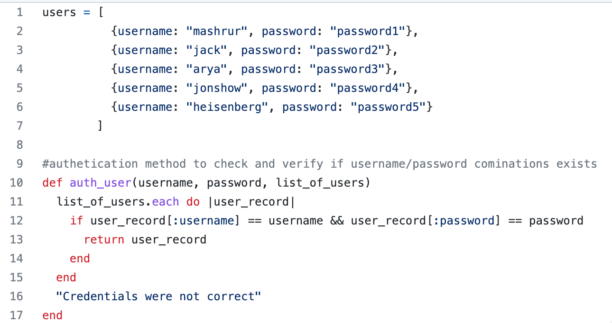

# <span></span> Welcome to Week 4 Day 3

##  At the end of today's lesson, you should understand:
1. [ExpressJs - Update, Delete & static assets](./1_expressjs_cont/instructor_notes/README.md)
2. [MongoDB](./2_mongodb/instructor_notes/README.md)
---

## Prerequisite knowledge
1. I know how to set up a server and make it listen to the port of my choice.
2. I know why I need to name views folder as ‘views’
3. I know the differences between <%= %> and <% %> in ejs.
4. I know the differences between req.body, req.params and req.query
5. I know how to create a show route
6. I know how to create an index route
7. I know how to create a new route
8. I know how to convert form data from a new route to a post request.
9. I know the differences between res.send and res.render
10. I know the differences between node and nodemon

*Note: If you are missing any of the prerequisite knowledge, please approach your instructor / TA for help

---

## Rules
1. [**Be Consistent**](#be-consistent)
2. [**Writing code is for people. Not machines**](#)
3. [**There is no such thing as a stupid question**](#)
4. [**Always verify your code and / or what you type in**](#)

### Be Consistent
1. **Be consistent** in the way you name variables. If you use `-` for separating words, ensure the **ENTIRE** codebase uses `-`. Not a mixture of `-` and `_` or others
2. **Be consistent** in your indentation. **Do NOT** mix space & tabs. Keep the number of spacings consistent. If you use 2 spaces, ensure the entire code base in the repository uses 2 spaces. If you mix spaces & tabs, this is what will happen.

3. Why? Programming is a team sport. If things are consistent, you know what to expect when you are working on other people's code. Same for when other people start working on your code

### Writing code is for people. Not machines
1. **KISS** - Keep It Stupid Simple. The best code are the ones that is stupid simple to read, follow & understand on first glance
2. Write comments only when needed. Please do not write it for the sake of writing comments. Make every word count. An example of unnecessary comment:
    ```
      // This variable is to see if its a dog
      let isADog = false;
    ```
3. Ensure every naming you do is clearly illustrate what the variable, function, etc is about.
    ```
      let isADog = false;
    ```
    An example is the above code. `is` illustrate it is a boolean. Wording is following camelCase to make it easy to differentiate between words.

### There is no such thing as a stupid question
1. If you have a question, chances are, someone else has the same question. Ask away.
2. If you ask, you are stupid once. If you don't ask, you will be stupid forever
3. The best are those who question and ask until they really understand

### Always verify your code and / or what you type in
1. Programming is always 1 or 0. Always verify your result to ensure it is exactly what you think it is

---

## Tips
1. It is OKAY to copy others. What is **NOT** ok is blindly copying. You have to understand what the code is doing. That is how you learn