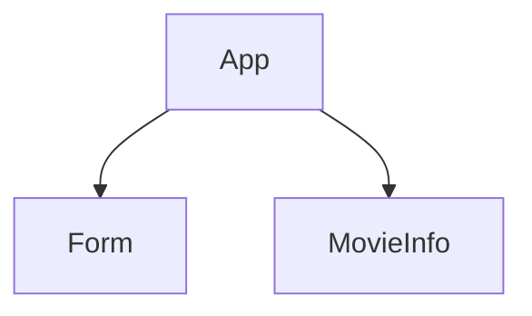

# Intro to AJAX in react

## Prerequisites

- React
- Components
- State and props
- Working with useEffect

**Note:**  If you haven't yet done so [request a FREE api key from OMDB](http://www.omdbapi.com/apikey.aspx)

## Learning Objectives

- Set up fetch and make API request in a React App
- Working with the useEffect hook

## What We Are Building

Here is a working version of the [OMBd Movie App](https://jmk0w.csb.app/) we will be building together.

## Mini Movie App

We're going to build a tiny React single page app that has a text input, a button and when a user inputs a movie, they will get a set of movies that match from OMDB.

---

### :alarm_clock: Activity - 2min

### Setup

- Fork the following [CodeSandbox Starter](https://codesandbox.io/s/omdb-movie-app-starter-q6c16?file=/src/App.js)
- Pass the `handleSubmit` method in `App` down to the `Form` Component and call it the same name.
- Confirm that the console log is outputting the captured value

<https://codesandbox.io/s/omdb-movie-app-starter-q6c16?file=/src/App.js>

---

### React Architecture

Our React architecture will look like the following:



---

## The `useEffect` Hook

Now it's time to use the `useEffect` Hook lets us perform the `side effects` of making the initial API call.

> A side effect is any application state change that is observable outside the called function other than its return value.

Several examples of `side effects` are:

- Logging to the console
- Making an API call
- Calling setInterval/setTimeout

As we pointed out in the last lecture on React lifecycle, `useEffect` and be run in one of 3 ways:

- `useEffect(() => {}, [])` - empty [] means this will only run once when the Component mounts
- `useEffect(() => {})`  - no [] means this will run on every render/re-render
- `useEffect(() => {}, [someValueToMonitor])` - run on mount and then only if the value has changed

### ComponentDidMount

Let's configure `useEffect` to run only once when the component mounts and fetch a movie of our choice.

In order for this to work properly we must make sure that `movieTitle` contains an initial value.

```js
const [movieTitle, setMovieTitle] = useState("star wars");
```

And now we will setup `useEffect` as `ComponentDidMount`.

```js
useEffect(() => {}, []);
```

Lets retrieve our data using the `fetch` API.

```js
useEffect(() => {
  const movieUrl = `https://www.omdbapi.com/?t=${movieTitle}&apikey=98e3fb1f`;

  const fetchData = async () => {
    const res = await fetch(movieUrl);
    const data = await res.json();
    console.log("movieData", data);
    setMovieData(data);
  };

  fetchData();
}, []);
```

We should see the following results in the console.

```js
{
  Title: "Eraserhead",
  Year: "1977",
  Rated: "Not Rated",
  Released: "03 Feb 1978",
  Runtime: "89 min",
  Genre: "Fantasy, Horror",
  Director: "David Lynch",
  Writer: "David Lynch",
  Actors: "Jack Nance, Charlotte Stewart, Allen Joseph, Jeanne Bates",
  Plot:
    "Henry Spencer tries to survive his industrial environment, his angry girlfriend, and the unbearable screams of his newly born mutant child.",
  Language: "English",
  Country: "USA",
  Awards: "2 wins & 1 nomination.",
  Poster:
    "https://m.media-amazon.com/images/M/MV5BMDExYzg5YjQtMzE0Yy00OWJjLThiZTctMWI5MzhjM2RmNjA4L2ltYWdlXkEyXkFqcGdeQXVyNTAyODkwOQ@@._V1_SX300.jpg",
  Ratings: [
    {
      Source: "Internet Movie Database",
      Value: "7.4/10",
    },
    {
      Source: "Rotten Tomatoes",
      Value: "90%",
    },
    {
      Source: "Metacritic",
      Value: "87/100",
    },
  ],
  Metascore: "87",
  imdbRating: "7.4",
  imdbVotes: "103,505",
  imdbID: "tt0074486",
  Type: "movie",
  DVD: "10 Aug 2016",
  BoxOffice: "N/A",
  Production: "American Film Institute",
  Website: "N/A",
  Response: "True",
}
```

<!--  -->

## Rendering our response in the Browser

Let's update the MovieInfo component to include the elements for the data we want to render.

```jsx title="MovieInfo.jsx" live
function MovieInfo(props) {
  return (
    <div>
      <h1>Title: </h1>
      <h2>Year: </h2>
      
      <h3>Genre: </h3>
      <h4>Plot: </h4>
    </div>
  );
}
```

---

### :alarm_clock: Props Activity - 10min

Examine the props that have been passed down and render the corresponding data for the element placeholders we've assigned.

---

### Conditionally Rendering The MovieInfo Component

Finally, let's add some conditional logic that will either render `MovieInfo` and pass in our movie data as props or render nothing at all.

```jsx title="App.js" {5}
return (
  <div className="App">
    <div>Best Movie App Ever</div>
    <Form handleSubmit={handleSubmit} />
    {movieData.Title ? <MovieInfo movie={movieData} /> : null}
  </div>
);
```

### ComponentDidUpdate

Since our `Form` is responsible for capturing the user input and using that input as our search criteria let's make sure it updates `movieTitle`.

```jsx title="App.js" {3}
const handleSubmit = (title) => {
  console.log("App - makeApiCall - title", title);
  setMovieTitle(title);
};
```

As we can see no movie data is being fetched when the user submits a new query.

So let's configure `useEffect` to re-run anytime the `movieTitle` has been updated.

To do this we will add a watch variable to `useEffect`.

```jsx title="App.js"
useEffect(() => {
  const movieUrl = `https://www.omdbapi.com/?t=${movieTitle}&apikey=98e3fb1f`;

  const fetchData = async () => {
    const res = await fetch(movieUrl);
    const data = await res.json();
    console.log("movieData", data);
    setMovieData(data);
  };

  fetchData();
}, [movieTitle]);
```