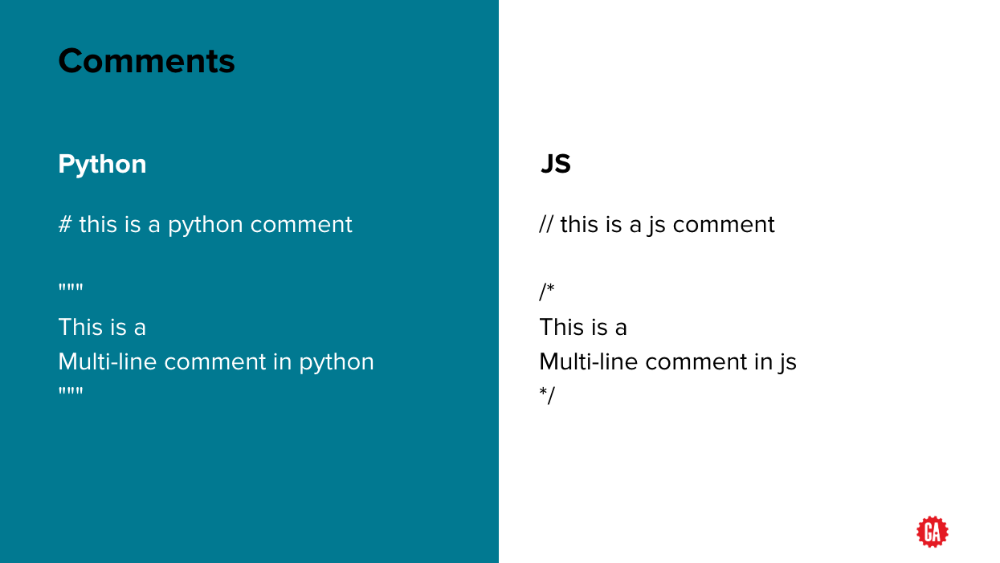
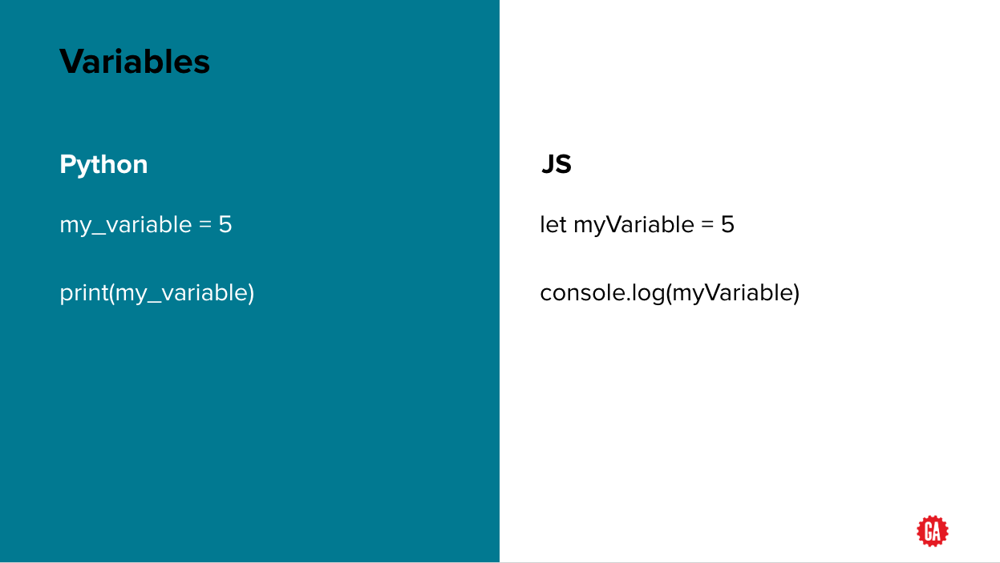
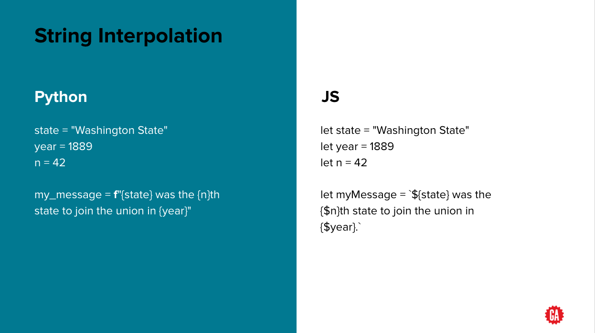
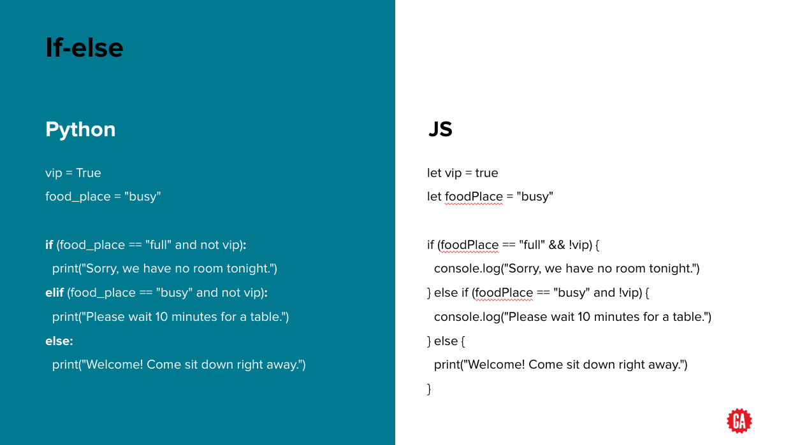

# <span></span> Welcome to Week 1 Day 3

##  At the end of this lesson, you should know about python's:
1. Comments
1. variables

---

## Comments



## Variables



**NOTE**
1. No `var`, `let`, `const` in python
1. Naming convention is `snake_case`
  - eg: `two_words` and not `twoWords`

## Primitive data types

1. Number
  - Integer: `x = 1`
  - Float: `x = 1.1`
  - Complex: `x = 2+3j`
    - note it is `j`
    - 2 refers to real number
    - 3 refers to imaginary number
    - Try: `x.real` & `x.imag`
1. String: `str = 'some thing'`
1. Boolean: `is_valid = True`
  - must start with Capital letter
  - **wrong:** `true` or `false`
  - **correct:** `True` or `False`
1. Nothingness: `x = None` (same as `null` in Javascript)

## Type conversion

This is a function to convert from 1 type to another
- `int('42')` => `42`
- `floar('42')` => `42.0`
- `str(42)` => `'42'`
- `bool(42)` => `True`

## Arithmetic

Python has all the basic arithmetic operations:
- `+`
- `-`
- `*`
- `/`
- `%`

Specially for division (`/`), you can do `//` which will force an integer division

## Large numbers

- exponents:
  - `2**3`
  - `3**999`

- equivalents in JS
  - `Math.pow(2,3)` or (`2**3` in es2022 onwards)
  - `Math.pow(3,999)` or (`3**999` in es2022 onwards)
    - try this and you will see that JS shows this using scientific notation

## Strings

- Just like in JS, python comes with a list of string methods you can use ([click here to see full list](https://docs.python.org/3/library/stdtypes.html#string-methods))

- some commonly used ones:
  - To find string length: `len('some string')`
  - To find existence of substring: `'eggs' in 'green eggs and ham'`

## Strings & ranges

- Python makes it easy to work with individual characters within a string by using **ranges**
- given `str = 'some string'`:
  - `str[index]` choose one letter at index
  - `str[-index]` choose letter at index counting backwards from the end.
  - `str[start:end]` get a range of letters from a start to end.
  - `str[start:end:step]` get a range of letters taking step sized steps between.
  - `str[:end]` omit the start index and grab letters from zero up to end.
  - `str[start:]` omit the end index and grab letters from start up to the end of the string.
  - `str[::-1]` reverses a string by going backwards with a step of -1 from start to end.

**NOTE:** [Click here for more reading on python strings](https://www.digitalocean.com/community/tutorials/an-introduction-to-string-functions-in-python-3)

## String interpolation



**NOTE:** You can also write string interpolation for python as below:

```python
my_message = "{} was the {}th state to join the union in {}".format(state, n, year)
```

## Logical operators

- Python uses `==` & `!=`. No such thing as `===` & `!==`
- Uses literal english words for others:
  - `and` vs `&&` in JS
  - `or` vs `||` in JS
  - `not` vs `!` in JS

## If-else



**NOTE:** There is no `switch-case` in python
