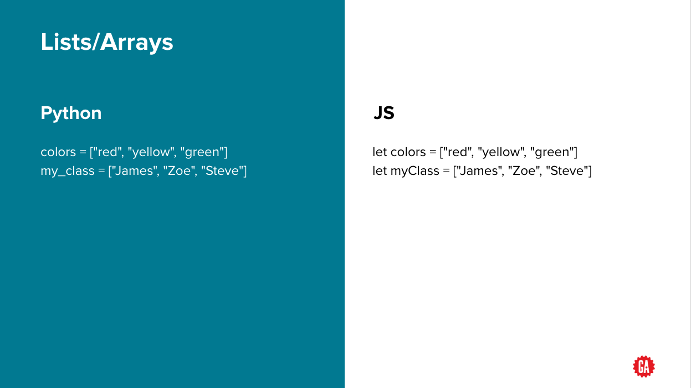
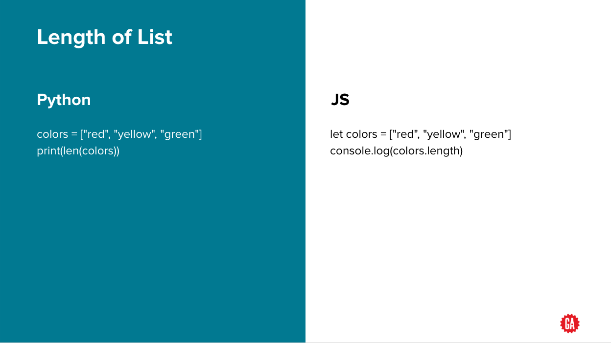
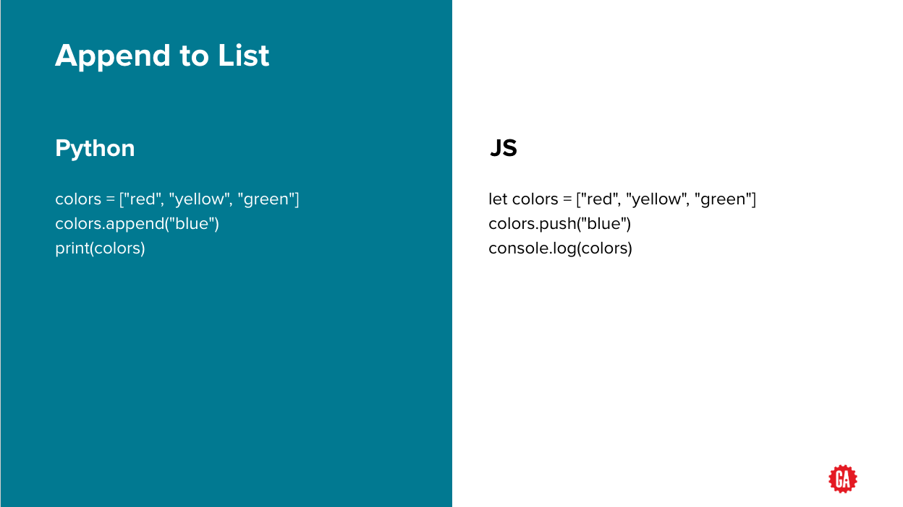
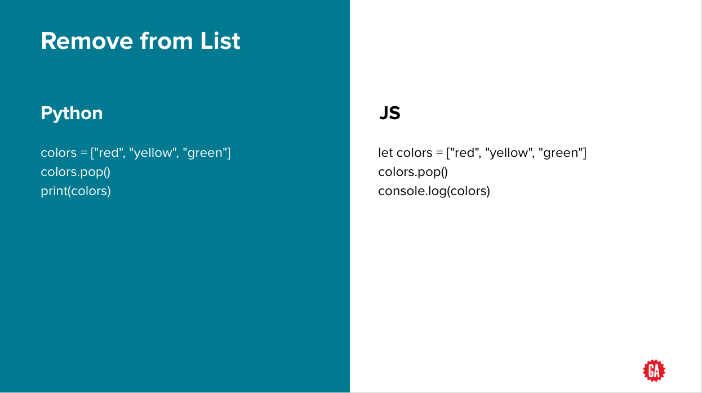
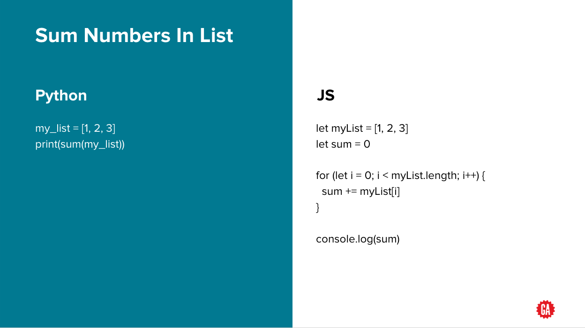
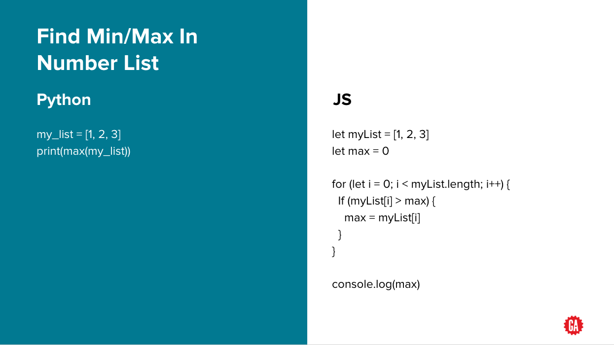

[](https://generalassemb.ly)

# Python Programming: Lists

## Overview

- In python, `lists` are `arrays`
- They have similar functionalities & methods as Javascript Arrays



## List operation: len()

- To get the length of list (number of items in the list)



## List operation: append()

- Add new item to the **end** of the list



## List operation: insert()

- Insert item to the list at a specified index


## List operation: pop()

- Remove item from **end** of list or at a specified index



## List operation: sum()

- Add all numbers in list



## List operation: min() / max()

- Find min / max number in list (only applicable to number lists)



---

## You Do: Lists

On your local computer, create a `.py` file named `list_practice.py`. In it:

1. Save a list with the numbers `2`, `4`, `6`, and `8` into a variable called `numbers`.
2. Print the max of `numbers`.
3. Pop the last element in `numbers` off; re-insert it at index `2`.
4. Pop the second number in `numbers` off.
5. Append `3` to `numbers`.
6. Print out the average number (divide the sum of `numbers` by the length).
7. Print `numbers`.

- You might pop off index 2 versus the actual 2nd element - watch out for that.

- Answer that's printed:
Max: 8
Average: 4.75
Final list: [2 8 6 3]

---

## Summary and Q&A

We accomplished quite a bit!

```python
# List Creation
my_list = ["red", 7, "yellow", 1]
# List Length
list_length = len(my_list) # 4
# List Index
print(my_list[0]) # red
# List Append
my_list.append("Yi") # ["red", 7, "yellow", 1, "Yi"]
# List Insert at Index
my_list.insert(1, "Sanju") # ["red", "Sanju", 7, "yellow", 1, "Yi"]
# List Delete
student_that_left = my_list.pop() # "Yi"; ["red", "Sanju", 7, "yellow", 1]
# List Delete at Index
student_that_left = my_list.pop(2) # 7; ["red", "Sanju", "yellow", 1]
```

---

## Summary and Q&A II

And for numerical lists only...

```python
# Sum all numbers in list
sum_avgs = sum(team_batting_avgs)
# Find minimum value of list
min(team_batting_avgs)
# Find maximum value of list
max(team_batting_avgs)
```

---

## Additional Resources

- [Python Lists - Khan Academy Video](https://www.youtube.com/watch?v=zEyEC34MY1A)
- [Google For Education: Python Lists](https://developers.google.com/edu/python/lists)
- [Python-Lists](https://www.tutorialspoint.com/python/python_lists.htm)

---

_Copyright 2022, General Assembly Space. Licensed under [CC-BY-NC-SA, 4.0](https://creativecommons.org/licenses/by-nc-sa/4.0/)_