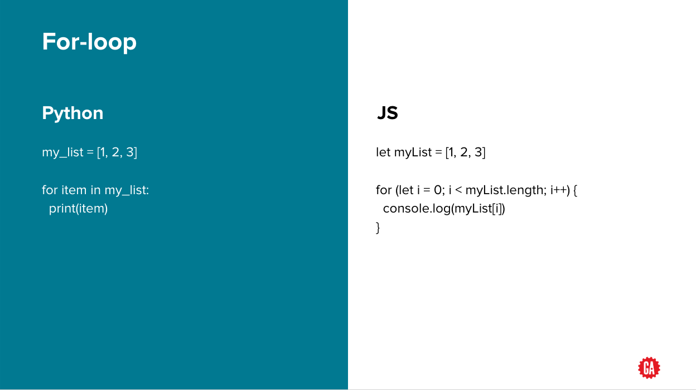

[](https://generalassemb.ly)

# Python Programming: Loops

## Overview

- Loops in python works similar to Javascript loops
- Python has an additional loop function called `range()`

## for-loop



Python `for-loop` can loop through strings too:

```python
my_string = "Hello, world!"
for character in my_string:
  print(character)
```

## range()

`range(x)`:

- Automatically generated.
- A list that contains only integers.
- Starts at zero.
- Stops before the number you input.

```python
range(5)  # => [0, 1, 2, 3, 4]
```

**Quick Checks**:

- You can actually feed more parameters into `range()` to control what number it starts at and how big each step is to the next number, but we will keep it simple for now. For now it is enough to know that if you loop over `range(5)` then your loop will execute **five** times. Let's use this in a loop...

---

## Looping Over a Range

Let's look at `range` in action:

```python
for i in range(10):
  print(i)

squares = []

for num in range(5):
  sqr = num ** 2
  squares.append(sqr)

print(squares)
```

**Quick Checks**:

- "We can see that this code prints each of the numbers in our range of 0 through 9 (10 numbers total.) We don't need to have our loop print anything. This loop could be used to execute any sequence of code 10 times. "

---

## Looping Over a Range II

Looping over `names` here is really just going through the loop 4 times -  at index `0`, `1`, `2`, and `3`.

We can instead use `range(x)` to track the index and  loop `names`: `range(4)` is `[0, 1, 2, 3]`.

We can then use `len(names)`, which is 4, as our range.

```python
names = ["Flint", "John Cho", "Billy Bones", "Nanda Yuna"]

for each_name in range(len(names)):
  print(names[each_name])
```

- Vary the size of range - try `range(4)`  and `range(2)` - so that you can see the differences.
- Give a bunch of examples. Range might make sense conceptually, but be hard to remember the syntax for and use.

**Quick Checks**:

- Recall that you can use the `len()` function to get the length of a list. Since that will always be an integer, we can feed that value into the `range()` function to generate a range that contains each index in the list.
- Don't be alarmed about the function inside the function. That's fairly common. Let's break it down: `len(names)` will return the length of the `names` list; in this case, 4. The number 4 is then used as the parameter for `range()` creating a range containing 0, 1, 2, and 3. These happen to all be valid indices for our list so we can use them to modify the values stored at those indices.

---

## Range to Modify Collections

Why would you use `range` on a list, when you could just loop the list?

We can't do:

```python
guest_list = ["Fred", "Cho", "Brandi", "Yuna", "Nanda", "Denise"]

for guest in guest_list:
  guest = "A new name"
```

But we can do:

```python
guest_list = ["Fred", "Cho", "Brandi", "Yuna", "Nanda", "Denise"]

for guest in range(len(guest_list)):
  guest_list[guest] = "A new name"
```

**Quick Checks**:

- "But there is one special use for this that is vital to know about. When we loop using `for item in collection` we can't ever really **modify** the elements in the list. Whenever we access `item` we are actually getting a copy of the item in the list. In order to **modify** the item in the list, we would need the index of that item in the list. And guess what `range()` gives us..."

---

## Looping Over a Range III

Let's make the list all uppercase:

```python
# This won't work

guest_list = ["Fred", "Cho", "Brandi", "Yuna", "Nanda", "Denise"]

for guest in guest_list:
  guest = guest.upper()

print("Without range, guest_list is", guest_list)

# This will!

for guest in range(len(guest_list)):
  guest_list[guest] = guest_list[guest].upper()

print("With range, guest_list is", guest_list)
```

- This is a bit difficult. Make sure that you understand that range hits the index versus a regular `for` loop makes a copy.

**Quick Checks**:

- Now when we run this we see that the `names` list has had all the string changed to uppercase. It is necessary to use list indices if you want to modify list elements. If we tried doing the same thing with an `item` from that `list` then the changes would only apply to the temporary copy stored in `item` and would never actually make it into the list.

---

## Knowledge Check: Which of the following lines is correct?

```python
my_list = ['mon', 'tue', 'wed', 'thu', 'fri']
```

```python
for day in range(my_list):       # A
for day in range(len(my_list)):    # B
for day in range(my_list.length):  # C
```

---

## You Do: Range

Locally, create a new file called `range_practice.py`.

In it:

- Create a list of colors.
- Using a `for` loop, print out the list.
- Using `range`, set each item in the list to be the number of characters in the list.
- Print the list.

For example:

```python
["red", "green", "blue"]
# => [3, 5, 4]
```

---

## Quick Review: For Loops and Range

`for` loops:

```python
# On a list (a collection of strings)
guest_list = ["Fred", "Cho", "Brandi", "Yuna", "Nanda", "Denise"]
for guest in guest_list:
  print("Hello, " + guest + "!")

# On a string (a collection of characters)
my_string = "Hello, world!"
for character in my_string:
  print(character)

##### Range #####

range(4)  # => [0, 1, 2, 3]

# Using Range as an Index Counter
names = ["Flint", "John Cho", "Billy Bones", "Nanda Yuna"]
for each_name in range(4):
  print(names[each_name])

# OR

for each_name in range(len(names)):
  print(names[each_name])

# Using Range to Change a List:

guest_list = ["Fred", "Cho", "Brandi", "Yuna", "Nanda", "Denise"]
for guest in range(len(guest_list)):
  guest_list[guest] = "A new name"
```

## while-loop

```python
a = 0
while a < 10:
  print(a)
  a += 1
```

---

## Additional Reading

- [Learn Python Programming: Loops Video](https://www.youtube.com/watch?v=JkQ0Xeg8LRI)
- [Python: For Loop](https://wiki.python.org/moin/ForLoop)
- [Python: Loops](https://www.tutorialspoint.com/python/python_loops.htm)

---

_Copyright 2022, General Assembly Space. Licensed under [CC-BY-NC-SA, 4.0](https://creativecommons.org/licenses/by-nc-sa/4.0/)_